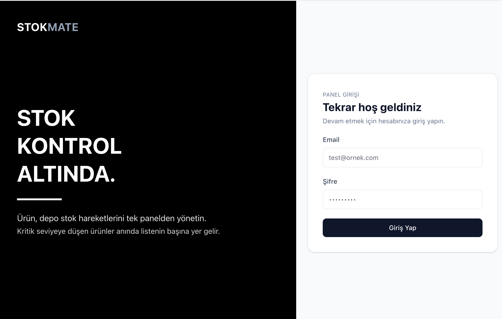
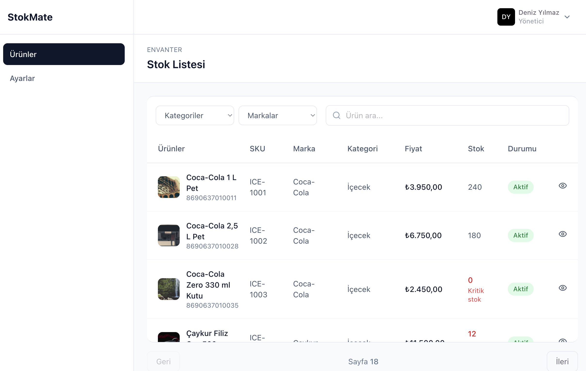
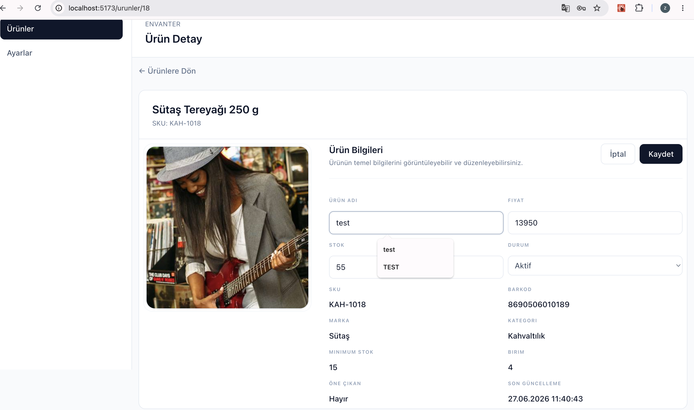

# 🚀 StokMate - Stok Yönetim Sistemi

StokMate, işletmelerin ürün ve stok süreçlerini yönetebilmesi için geliştirilmiş modern bir stok yönetim uygulamasıdır.

Proje, ölçeklenebilir ve sürdürülebilir frontend mimarisi oluşturmak amacıyla **Feature-Based Architecture** yaklaşımı ile geliştirilmiştir.

Uygulama içerisinde ürün yönetimi, kullanıcı yönetimi, authentication süreçleri ve API entegrasyonları modern React geliştirme prensipleri kullanılarak yapılandırılmıştır.

---

# 🛠️ Kullanılan Teknolojiler

## Frontend

* React
* Vite
* JavaScript / TypeScript
* React Router DOM
* Tailwind CSS
* Lucide React

## State & Data Management

* Zustand
* TanStack React Query
* Axios

## UI

* Atomic Design yaklaşımı
* Component Based Architecture
* Responsive Design

---

# 🏗️ Proje Mimarisi

StokMate projesinde sürdürülebilir ve ölçeklenebilir bir yapı oluşturmak için **Feature-Based Architecture** kullanılmıştır.

```bash
src
│
├── app
│   ├── App.tsx
│   ├── router.tsx
│   └── providers
│       └── AppProviders.tsx
│
├── features
│   │
│   ├── auth
│   │   ├── adapters
│   │   ├── api
│   │   ├── components
│   │   ├── hooks
│   │   ├── pages
│   │   ├── providers
│   │   ├── repositories
│   │   ├── store
│   │   └── types
│   │
│   └── product
│       ├── adapters
│       ├── api
│       ├── components
│       ├── container
│       ├── hooks
│       ├── pages
│       ├── providers
│       ├── repositories
│       ├── schemas
│       ├── types
│       └── utils
│
├── shared
│   ├── components
│   │   └── atoms
│   │       └── Atomic Design
│   │
│   └── hooks
│
└── lib
    ├── apiClient.ts
    └── authStorage.ts
```

---

# 🧩 Kullanılan Mimari Yaklaşımlar

## Feature-Based Architecture

Her özellik kendi içerisinde bağımsız bir modül olarak tasarlanmıştır.

Örneğin:

```
features
 ├── auth
 └── product
```

Bu yapı sayesinde:

* Özellikler birbirinden bağımsız geliştirilir.
* Kod organizasyonu kolaylaşır.
* Proje büyüdükçe yönetilebilir kalır.

---

# 🔌 Repository Pattern

API işlemleri componentlerden ayrılarak repository katmanında yönetilmiştir.

Veri akışı:

```
Component
    ↓
Hook
    ↓
Repository
    ↓
API
    ↓
Backend
```

Avantajları:

* API bağımlılığını azaltır.
* Test edilebilirliği artırır.
* Business logic ayrımı sağlar.

---

# 🔄 Provider Pattern

Uygulama içerisindeki global bağımlılıklar provider yapısı ile yönetilmiştir.

Kullanılan yapılar:

* React Query Provider
* Global Application Providers
* Feature Providers

Akış:

```
App
 |
AppProviders
 |
Application
```

---

# 🔐 Authentication Yapısı

Auth modülü aşağıdaki katmanlardan oluşmaktadır:

```
auth
├── adapters
├── api
├── components
├── hooks
├── pages
├── providers
├── repositories
├── store
└── types
```

Özellikler:

* Kullanıcı giriş işlemleri
* Token yönetimi
* Zustand state yönetimi
* Local storage persistence
* Auth hydration
* Protected route yapısı

Authentication akışı:

```
Login
 |
Repository
 |
Store Update
 |
Storage Save
 |
Application Hydration
```

---

# 📦 Product Modülü

Ürün yönetimi aşağıdaki yapı ile geliştirilmiştir:

```
product
├── adapters
├── api
├── components
├── container
├── hooks
├── pages
├── providers
├── repositories
├── schemas
├── types
└── utils
```

Desteklenen işlemler:

* Ürün listeleme
* Ürün detay görüntüleme
* Ürün güncelleme
* API cache yönetimi
* Form validation
* Loading ve error state yönetimi

---

# 🎨 Atomic Design

Tekrar kullanılabilir UI bileşenleri Atomic Design yaklaşımı ile oluşturulmuştur.

```
shared
 |
 components
 |
 atoms
```

Amaç:

* Tekrar kullanılabilir componentler
* Tutarlı UI yapısı
* Daha kolay bakım

---

# ⚡ State Yönetimi

## Zustand

Client state yönetimi için kullanılmıştır.

Örnek kullanım alanları:

* Authentication state
* Kullanıcı bilgileri
* Global uygulama durumları

## React Query

Server state yönetimi için kullanılmıştır.

Sağladığı özellikler:

* API cache yönetimi
* Refetch işlemleri
* Loading state
* Error handling
* Query invalidation

---

# 📡 API Yapısı

Axios üzerinden merkezi API yönetimi yapılmıştır.

Yapı:

```
apiClient
    |
API Layer
    |
Repository
    |
Hook
    |
Component
```

Avantajları:

* Merkezi HTTP yönetimi
* Token interceptor kullanımı
* Daha temiz veri akışı

---

## 📸 Ekran Görüntüleri

### Giriş Ekranı

<p align="center">
  
</p>

### Ürün Listesi

<p align="center">
  
</p>

### Ürün Detayı

<p align="center">
  
</p>

---

# 🚀 Kurulum

Projeyi klonlayın:

```bash
git clone <repository-url>
```

Bağımlılıkları yükleyin:

```bash
npm install
```

Environment dosyasını oluşturun:

```
.env
```

Örnek:

```env
VITE_API_BASE_URL=
VITE_ACCESS_TOKEN_KEY=
VITE_REFRESH_TOKEN_KEY=
```

Projeyi çalıştırın:

```bash
npm run dev
```

---

# 🎯 Proje Amacı

StokMate sadece temel CRUD işlemleri yapan bir uygulama olarak değil;

* Ölçeklenebilir frontend mimarisi
* Clean code yaklaşımı
* Modern React geliştirme pratikleri
* Pattern kullanımı
* Sürdürülebilir proje yapısı

amaçlanarak geliştirilmiştir.

---

# 👩‍💻 Developer

**Zeynep Baş**

Frontend Engineer

React • Next.js • Modern Frontend Architecture
